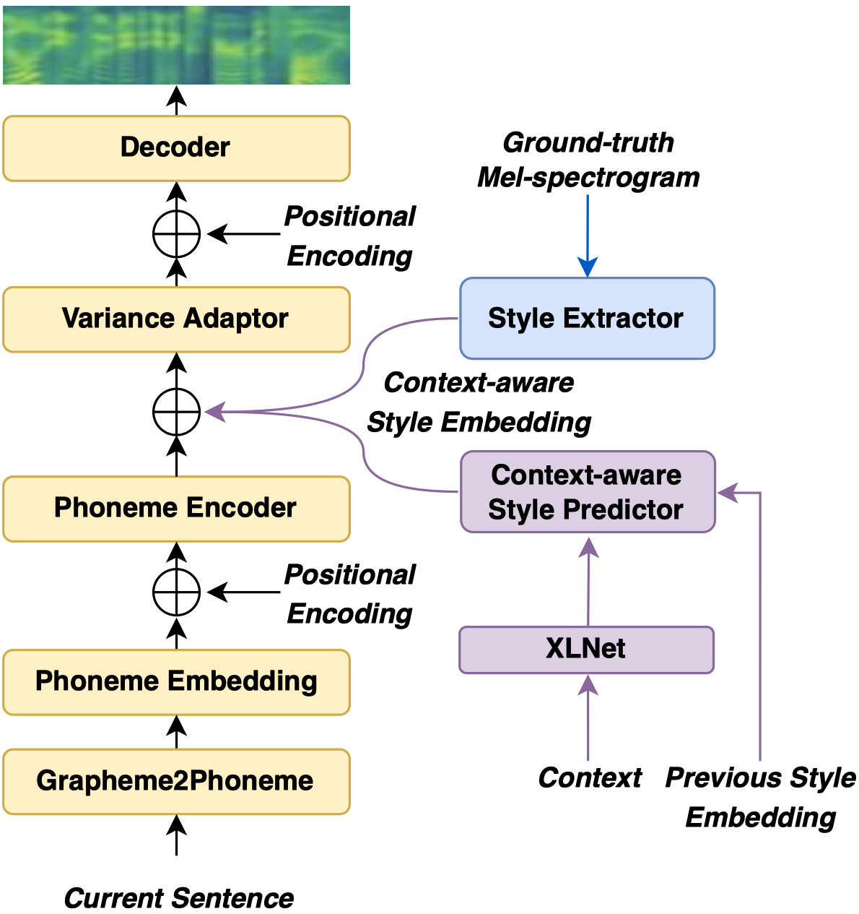
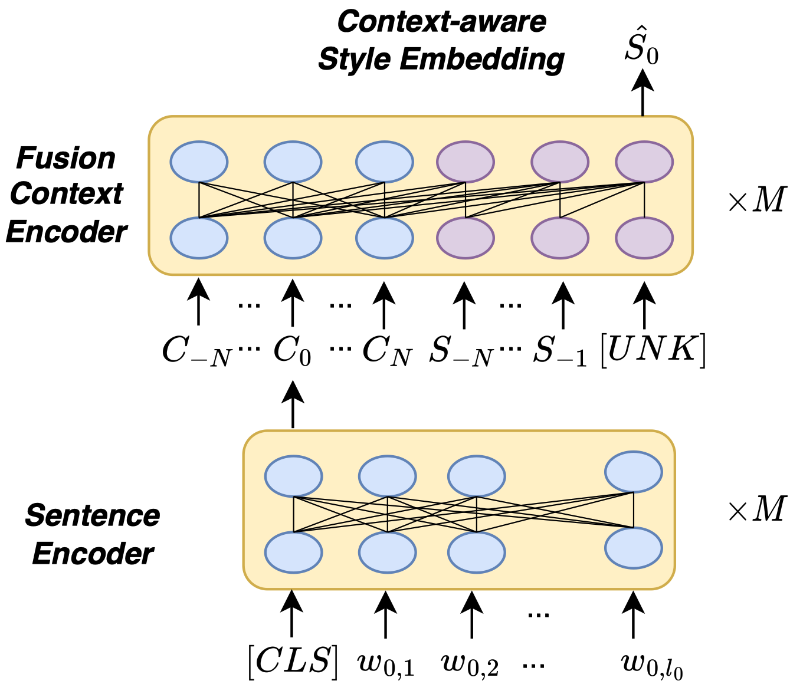
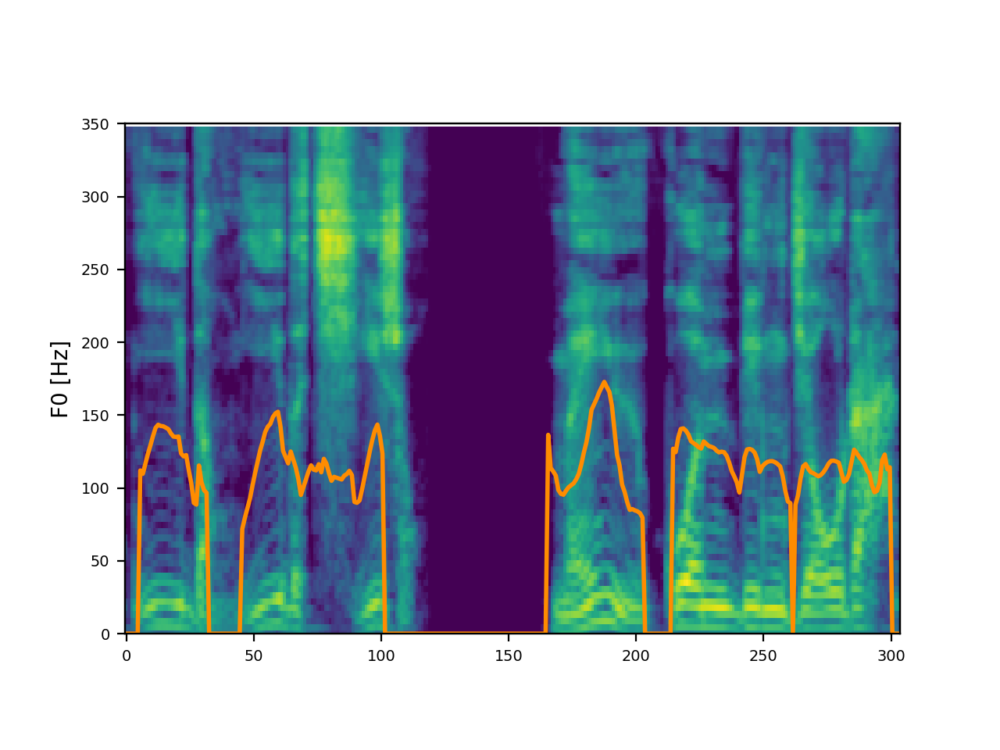
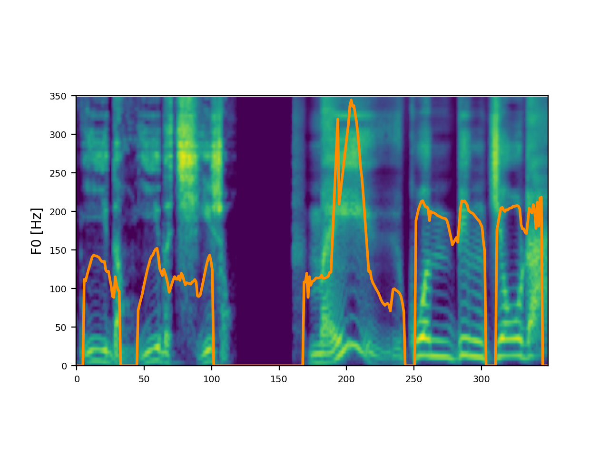
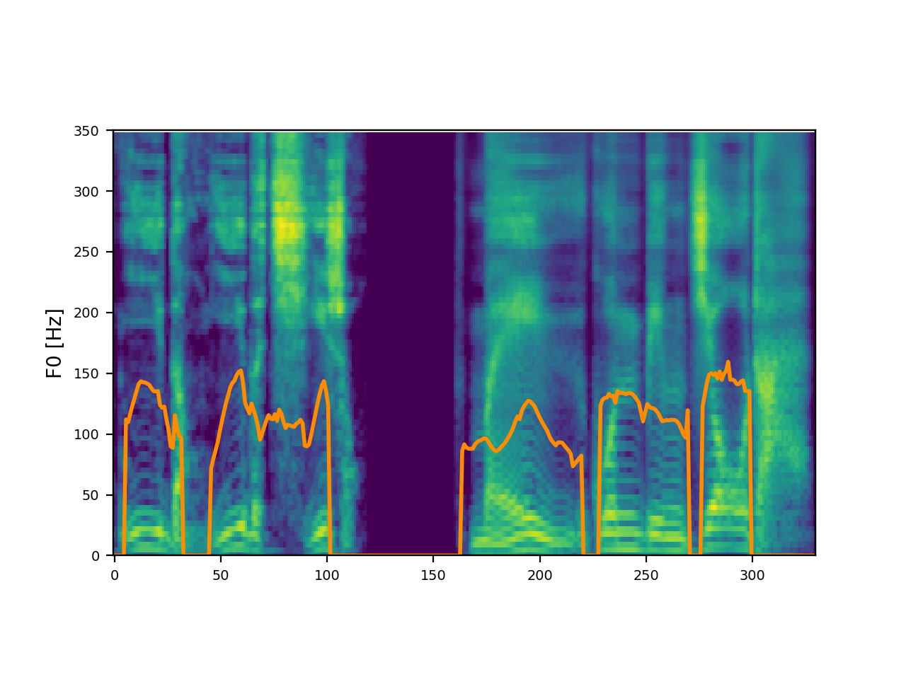
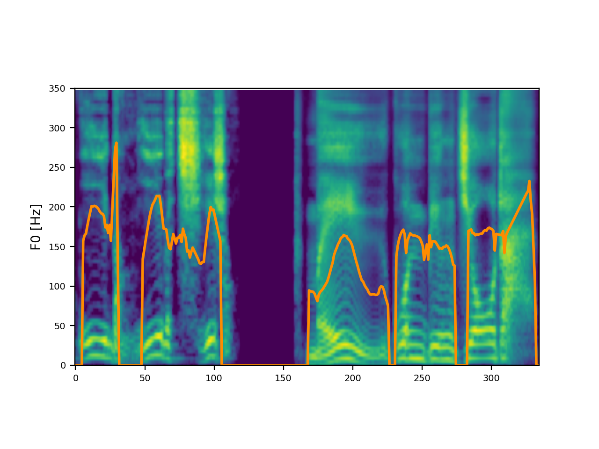

# Abstract

Recent advances in text-to-speech have significantly improved the expressiveness of synthesized speech. However, it is still challenging to generate speech with contextually appropriate and coherent speaking style for multi-sentence text in audiobooks. In this paper, we propose a context-aware coherent speaking style prediction method for audiobook speech synthesis. To predict the style embedding of the current utterance, a hierarchical transformer-based context-aware style predictor with a mixture attention mask is designed, considering both text-side context information and speech-side style information of previous speeches. Based on this, we can generate long-form speech with coherent style and prosody sentence by sentence. Objective and subjective evaluations on a Mandarin audiobook dataset demonstrate that our proposed model can generate speech with more expressive and coherent speaking style than baselines, for both single-sentence and multi-sentence test.

    
    
     
    
 Fig.1: The architecture of the proposed model. 

# Subjective Evaluation

To demonstrate that our proposed model can significantly improve the naturalness and expressiveness of the synthesized speech, some samples are provided for comparison.   **GT (Reconstructed)** means the audio reconstructed from ground truth Mel-spectrogram. **FastSpeech 2** means an open-source implementation of FastSpeech 2. **HCE** means hierarchical context encoder (HCE) model, which predicts the style on global-level from the context. In addition, a well-trained HIFI-GAN is used as the vocoder to generate waveform.

## Single-sentence

| Target Chinese Text | GT (Reconstructed) | FastSpeech 2 | HCE | Proposed |
| :---- | :---- | :---- | :---- | :---- |
| 麻雷子的声响惊醒了正在睡回笼觉儿的黄五爷。 | <audio controls><source src="./wavs/gt/0.wav" type="audio/wav">Your browser does not support the audio element.</audio> | <audio controls><source src="./wavs/fs2/0.wav" type="audio/wav">Your browser does not support the audio element.</audio> | <audio controls><source src="./wavs/hce/0.wav" type="audio/wav">Your browser does not support the audio element.</audio> | <audio controls><source src="./wavs/proposed/0.wav" type="audio/wav">Your browser does not support the audio element.</audio> |
| 双录听勾秀云说叔叔要让他回屯开荒,嘴撅得能拴个驴啦，嘟嘟囔囔的说。 | <audio controls><source src="./wavs/gt/1.wav" type="audio/wav">Your browser does not support the audio element.</audio> | <audio controls><source src="./wavs/fs2/1.wav" type="audio/wav">Your browser does not support the audio element.</audio> | <audio controls><source src="./wavs/hce/1.wav" type="audio/wav">Your browser does not support the audio element.</audio> | <audio controls><source src="./wavs/proposed/1.wav" type="audio/wav">Your browser does not support the audio element.</audio> |
| 包氏红着脸点了点头儿，勾秀云邪性地加了一句。 | <audio controls><source src="./wavs/gt/2.wav" type="audio/wav">Your browser does not support the audio element.</audio> | <audio controls><source src="./wavs/fs2/2.wav" type="audio/wav">Your browser does not support the audio element.</audio> | <audio controls><source src="./wavs/hce/2.wav" type="audio/wav">Your browser does not support the audio element.</audio> | <audio controls><source src="./wavs/proposed/2.wav" type="audio/wav">Your browser does not support the audio element.</audio> |
| 双录应声出去了，一会儿工夫，余为农尴尴尬尬地进了饭馆儿。 | <audio controls><source src="./wavs/gt/3.wav" type="audio/wav">Your browser does not support the audio element.</audio> | <audio controls><source src="./wavs/fs2/3.wav" type="audio/wav">Your browser does not support the audio element.</audio> | <audio controls><source src="./wavs/hce/3.wav" type="audio/wav">Your browser does not support the audio element.</audio> | <audio controls><source src="./wavs/proposed/3.wav" type="audio/wav">Your browser does not support the audio element.</audio> |
| 双录瘪了瘪嘴。 | <audio controls><source src="./wavs/gt/4.wav" type="audio/wav">Your browser does not support the audio element.</audio> | <audio controls><source src="./wavs/fs2/4.wav" type="audio/wav">Your browser does not support the audio element.</audio> | <audio controls><source src="./wavs/hce/4.wav" type="audio/wav">Your browser does not support the audio element.</audio> | <audio controls><source src="./wavs/proposed/4.wav" type="audio/wav">Your browser does not support the audio element.</audio> |

## Multi-sentence

| Target Chinese Text                                          | GT (Reconstructed)                                           | FastSpeech 2                                                 | HCE                                                          | Proposed                                                     |
| ------------------------------------------------------------ | :----------------------------------------------------------- | ------------------------------------------------------------ | ------------------------------------------------------------ | ------------------------------------------------------------ |
| 麻雷子的声响惊醒了正在睡回笼觉儿的黄五爷。他问儿媳妇儿乌雅氏，才知道是余家竖旗杆，觉得可笑。 | <audio controls><source src="./wavs/gt/6.wav" type="audio/wav">Your browser does not support the audio element.</audio> | <audio controls><source src="./wavs/fs2/6.wav" type="audio/wav">Your browser does not support the audio element.</audio> | <audio controls><source src="./wavs/hce/6.wav" type="audio/wav">Your browser does not support the audio element.</audio> | <audio controls><source src="./wavs/proposed/6.wav" type="audio/wav">Your browser does not support the audio element.</audio> |
| 唱词写得也好，又是古城子身边儿的人和事儿，商民们争先恐后地前往观看。南班主在开演之前，习惯地往下看了看。只见人群中间站着一个衣着简朴却气宇轩昂的老者，身边儿是几个身材魁梧的壮汉。 | <audio controls><source src="./wavs/gt/7.wav" type="audio/wav">Your browser does not support the audio element.</audio> | <audio controls><source src="./wavs/fs2/7.wav" type="audio/wav">Your browser does not support the audio element.</audio> | <audio controls><source src="./wavs/hce/7.wav">Your browser does not support the audio element.</audio> | <audio controls><source src="./wavs/proposed/7.wav" type="audio/wav">Your browser does not support the audio element.</audio> |
| 见明大人在雅间儿里独自饮酒，隔着掀上去的门帘儿就跪下了。“小的余为农给明大老爷请安，不知叫小的有何吩咐。”明保端详了几眼余为农，余为农粗黑蛮壮。 | <audio controls><source src="./wavs/gt/5.wav" type="audio/wav">Your browser does not support the audio element.</audio> | <audio controls><source src="./wavs/fs2/5.wav" type="audio/wav">Your browser does not support the audio element.</audio> | <audio controls><source src="./wavs/hce/5.wav" type="audio/wav">Your browser does not support the audio element.</audio> | <audio controls><source src="./wavs/proposed/5.wav" type="audio/wav">Your browser does not support the audio element.</audio> |
| 洋夜猫子进宅啦，役通知各大车店。自己想办法，不要容留他们住宿。各大车店掌柜得到通知，都把韦廉臣拒之门外。 | <audio controls><source src="./wavs/gt/9.wav" type="audio/wav">Your browser does not support the audio element.</audio> | <audio controls><source src="./wavs/fs2/9.wav" type="audio/wav">Your browser does not support the audio element.</audio> | <audio controls><source src="./wavs/hce/9.wav" type="audio/wav">Your browser does not support the audio element.</audio> | <audio controls><source src="./wavs/proposed/9.wav" type="audio/wav">Your browser does not support the audio element.</audio> |
| 黄五爷早从双录的口里就得知了穆隆阿来屯，捏着鹰嘴儿铁核桃等在高间儿里。穆隆阿领着六格进屋儿，打千儿请安行叩拜大礼。 | <audio controls><source src="./wavs/gt/8.wav" type="audio/wav">Your browser does not support the audio element.</audio> | <audio controls><source src="./wavs/fs2/8.wav" type="audio/wav">Your browser does not support the audio element.</audio> | <audio controls><source src="./wavs/hce/8.wav" type="audio/wav">Your browser does not support the audio element.</audio> | <audio controls><source src="./wavs/proposed/8.wav" type="audio/wav">Your browser does not support the audio element.</audio> |

# Ablation Study

| Target Chinese Text                                          | GT (Reconstructed)                                           | Proposed                                                     | without mixture attention mask                               | without previous style information                           | without hierarchical architecture                            |
| ------------------------------------------------------------ | ------------------------------------------------------------ | ------------------------------------------------------------ | :----------------------------------------------------------- | :----------------------------------------------------------- | :----------------------------------------------------------- |
| 唱词写得也好，又是古城子身边儿的人和事儿，商民们争先恐后地前往观看。南班主在开演之前，习惯地往下看了看。只见人群中间站着一个衣着简朴却气宇轩昂的老者，身边儿是几个身材魁梧的壮汉。 | <audio controls><source src="./wavs/cmos/gt/0.wav" type="audio/wav">Your browser does not support the audio element.</audio> | <audio controls><source src="./wavs/cmos/proposed/0.wav" type="audio/wav">Your browser does not support the audio element.</audio> | <audio controls><source src="./wavs/cmos/-mask/0.wav" type="audio/wav">Your browser does not support the audio element.</audio> | <audio controls><source src="./wavs/cmos/-style/0.wav" type="audio/wav">Your browser does not support the audio element.</audio> | <audio controls><source src="./wavs/cmos/-hierarchical/0.wav" type="audio/wav">Your browser does not support the audio element.</audio> |
| 余庆在闭目用心算着账，判断着各家儿掌柜的态度和能力，他睁开眼睛摇了摇头。“这些个烧商，不是财大气粗有钱有势，就是些哈剌皮带滚筋的土豪。别整那么复杂，我看就这样儿吧。” | <audio controls><source src="./wavs/cmos/gt/1.wav" type="audio/wav">Your browser does not support the audio element.</audio> | <audio controls><source src="./wavs/cmos/proposed/1.wav" type="audio/wav">Your browser does not support the audio element.</audio> | <audio controls><source src="./wavs/cmos/-mask/1.wav" type="audio/wav">Your browser does not support the audio element.</audio> | <audio controls><source src="./wavs/cmos/-style/1.wav" type="audio/wav">Your browser does not support the audio element.</audio> | <audio controls><source src="./wavs/cmos/-hierarchical/1.wav" type="audio/wav">Your browser does not support the audio element.</audio> |
| 呃，黄五爷勃然大怒。“你也忒小看了爱新觉罗了！漫说我一家五口儿有三口儿吃着朝廷俸禄，日子还过得去。” | <audio controls><source src="./wavs/cmos/gt/2.wav" type="audio/wav">Your browser does not support the audio element.</audio> | <audio controls><source src="./wavs/cmos/proposed/2.wav" type="audio/wav">Your browser does not support the audio element.</audio> | <audio controls><source src="./wavs/cmos/-mask/2.wav" type="audio/wav">Your browser does not support the audio element.</audio> | <audio controls><source src="./wavs/cmos/-style/2.wav" type="audio/wav">Your browser does not support the audio element.</audio> | <audio controls><source src="./wavs/cmos/-hierarchical/2.wav" type="audio/wav">Your browser does not support the audio element.</audio> |
| 我是高看你们了，害得我受了半宿清冻。走吧，咋来的咋回吧，明大老爷还等着给你们披红戴花儿呐。桂三儿提着一口气儿赶到这儿，见着富征额彻底就泄了，一屁股坐在地上。 | <audio controls><source src="./wavs/cmos/gt/3.wav" type="audio/wav">Your browser does not support the audio element.</audio> | <audio controls><source src="./wavs/cmos/proposed/3.wav" type="audio/wav">Your browser does not support the audio element.</audio> | <audio controls><source src="./wavs/cmos/-mask/3.wav" type="audio/wav">Your browser does not support the audio element.</audio> | <audio controls><source src="./wavs/cmos/-style/3.wav" type="audio/wav">Your browser does not support the audio element.</audio> | <audio controls><source src="./wavs/cmos/-hierarchical/3.wav" type="audio/wav">Your browser does not support the audio element.</audio> |
| 哈，从新疆调防到这儿一个半月啦。对了，梅将军府的奶奶们前脚儿刚到啊，安排在会友店了。你们也去那里吧，我也好一并招待呀。 | <audio controls><source src="./wavs/cmos/gt/4.wav" type="audio/wav">Your browser does not support the audio element.</audio> | <audio controls><source src="./wavs/cmos/proposed/4.wav" type="audio/wav">Your browser does not support the audio element.</audio> | <audio controls><source src="./wavs/cmos/-mask/4.wav" type="audio/wav">Your browser does not support the audio element.</audio> | <audio controls><source src="./wavs/cmos/-style/4.wav" type="audio/wav">Your browser does not support the audio element.</audio> | <audio controls><source src="./wavs/cmos/-hierarchical/4.wav" type="audio/wav">Your browser does not support the audio element.</audio> |

# Case Study

| Model | Target Chinese Text | Audio | Mel-Spectrogram |
| ----- | ----- | ----- | :---: |
| GT (Reconstructed) | 这小子彪悍呐，手下有二百多喽啰，都是草原上一等一的骑手。每与官兵交战，按照狼群捕杀黄羊的阵势布阵，无人能敌。 | <audio controls><source src="./wavs/casestudy/case_gt.wav" type="audio/wav">Your browser does not support the audio element.</audio> |  |
| HCE | 这小子彪悍呐，手下有二百多喽啰，都是草原上一等一的骑手。每与官兵交战，按照狼群捕杀黄羊的阵势布阵，无人能敌。 | <audio controls><source src="./wavs/casestudy/case_hce.wav" type="audio/wav">Your browser does not support the audio element.</audio> |  |
| Proposed | 这小子彪悍呐，手下有二百多喽啰，都是草原上一等一的骑手。每与官兵交战，按照狼群捕杀黄羊的阵势布阵，无人能敌。 | <audio controls><source src="./wavs/casestudy/case_pro.wav" type="audio/wav">Your browser does not support the audio element.</audio> |  |
| Proposed with F0 shifted +50 Hz | 这小子彪悍呐，手下有二百多喽啰，都是草原上一等一的骑手。每与官兵交战，按照狼群捕杀黄羊的阵势布阵，无人能敌。 | <audio controls><source src="./wavs/casestudy/case_change.wav" type="audio/wav">Your browser does not support the audio element.</audio> |  |

# A sample of long-term text

| Target Chinese Text                                          | FastSpeech 2                                                 | HCE                                                          | Proposed                                                     |
| ------------------------------------------------------------ | ------------------------------------------------------------ | ------------------------------------------------------------ | ------------------------------------------------------------ |
| 你们看看，旗丁报名何等踊跃，简直是趋之若鹜。可我们官员呐，却罐儿养王八——缩缩儿了，没有一个儿靠前的，这成何体统！”汪半城看了一眼图敏，图敏微微点了点头。见图敏首肯，汪半城站了起来：“协宪大人息怒，下官不才，愿意带队前往古城子。只是下官官职低了些，不知是否可以？”协领大人见终于有人自告奋勇，憋着的怒气松了一半儿。又见主动请缨者是武举人汪半城，不禁有些喜出望外。“诶呀汪武举文武全才，当然可以啦。本官拟任你为委佐领，待报请将军衙门后再作定夺。”委佐领，就是代理佐领，不提级别，不增俸禄。盛京旗丁受汉民影响较大，精于农事。闻古城子地广人稀，土质肥沃，都奔求着最后剩到手里的十垧永不纳粮的恒田呐。那是多大的一片土地呀！受愿景的诱惑，盛京报名的旗丁大大超出了派给的名额。 | <audio controls><source src="./wavs/longtext/fs2/7.wav" type="audio/wav">Your browser does not support the audio element.</audio> | <audio controls><source src="./wavs/longtext/hce/7.wav" type="audio/wav">Your browser does not support the audio element.</audio> | <audio controls><source src="./wavs/longtext/proposed/7.wav" type="audio/wav">Your browser does not support the audio element.</audio> |
